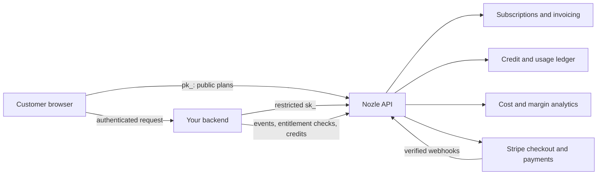

Nozle separates public catalog UI from customer-authorized billing operations. Browsers can read plans with a publishable key; your authenticated backend owns every customer lookup and mutation.

## Overview



## Trust boundaries

### Browser

The browser may:

- fetch the public plan catalog with `pk_`;
- render React SDK components; and
- call your authenticated merchant routes.

It must not receive a Nozle secret key or choose an authoritative customer, subscription, Entity, or credit account.

### Merchant backend

Your backend:

- authenticates the application user;
- derives Nozle identifiers from server-owned records;
- validates plan codes and exact return origins;
- calls Nozle with a least-privilege `sk_`; and
- returns only the fields required by the browser.

### Nozle API

The API handles:

- plan catalog and subscriptions;
- payment-aware checkout and settlement transitions;
- usage events and invoice aggregation;
- product-credit grants, top-ups, transfers, and atomic consumption;
- entitlement decisions;
- cost models and margin reporting; and
- durable payment and usage-event reconciliation.

## Payment authority

Stripe collects payment details and sends signed events to Nozle. A redirect or browser callback never activates a paid plan by itself. Nozle applies payment-gated changes only after verified webhook processing.

## Request flows

### Entitlement check

```text
Your backend
  -> derives customer from the authenticated user
  -> calls can(customer, feature)
  -> receives allow/deny, usage, and optional margin context
  -> enforces the result before protected work
```

### Metered event

```text
Your worker
  -> sends a stable transaction ID and metric properties
  -> Nozle validates and records the event
  -> billing aggregation includes it in the configured period
```

### Credit-backed action

```text
Your backend
  -> calls usage.track with an idempotency key
  -> Nozle locks eligible credit sources
  -> records an immutable operation and exact deductions
  -> publishes the matching billing event through a durable outbox
```

### Paid checkout

```text
Browser -> merchant backend -> Nozle checkout -> Stripe
Stripe webhook -> Nozle verifies payment -> subscription change applies
Browser refreshes billing state from merchant backend
```

## Optional realtime delivery

Realtime customer updates require a server-authorized token flow. The current React SDK does not fetch customer entitlements or mint realtime tokens from a publishable key. Applications may refresh through authenticated backend reads or operate their own authorized realtime channel.
