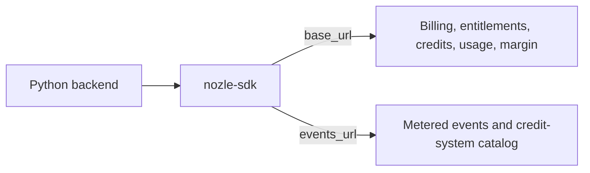

`nozle-sdk` supports Python 3.9 through 3.13, uses `requests`, and includes a `py.typed` marker.

Entity subscription APIs are introduced in `0.5.0`.

```bash
pip install nozle-sdk
```

## Create a client

```python
import os

from nozle import Nozle

nozle = Nozle(
    api_key=os.environ["NOZLE_SECRET_KEY"],
    base_url="https://api.nozle.app",
    events_url="https://api.nozle.app",
    timeout=10,
)
```

| Argument | Type | Default | Description |
|---|---|---|---|
| `api_key` | `str` | required | Organization credential. Protected operations require `sk_`. |
| `base_url` | `str` | `http://localhost:8080` | Billing, entitlement, credit, Entity, usage, and margin API origin. |
| `events_url` | `str` | `http://localhost:3000` | Metered event and credit-system API origin. |
| `timeout` | `float` | `10` | Per-request timeout in seconds. |

Set both URLs explicitly outside local development. Trailing slashes are removed automatically.



## Manage the HTTP session

The client is synchronous and owns a reusable `requests.Session`. Use it as a context manager when its lifetime is scoped:

```python
from nozle import Nozle

with Nozle(
    api_key=os.environ["NOZLE_SECRET_KEY"],
    base_url="https://api.nozle.app",
    events_url="https://api.nozle.app",
) as nozle:
    health = nozle.ping()
```

For an application-wide singleton, call `nozle.close()` during shutdown.

## Authentication model

- `plans()` accepts either a publishable `pk_` or secret `sk_` key.
- Every customer, event, checkout, subscription, credit, Entity, usage, entitlement, health, and margin operation requires `sk_`.
- Wrong key types fail locally with `NozleAuthenticationError` before network I/O.

<Warning>
This is a backend SDK. Never expose an `sk_`, master key, or internal credential to browser or mobile code.
</Warning>

## API surface

| Area | Methods |
|---|---|
| API | `ping()`, `plans()`, `track()`, `can()` |
| Billing | `checkout()`, `subscribe()`, `cancel_subscription()`, transition preview/apply |
| Customers | `customers.upsert()` |
| Credit systems | `credit_systems.list()` |
| Entities | `get()`, `list()`, `upsert()`, `activate()`, `suspend()`, `bulk_upsert()` |
| Entity subscriptions | `ensure()`, `get()`, `list()`, `checkout()`, `change_plan()`, `cancel()`, `remove()` |
| Credits | Customer and Entity balance/history reads, `allocate()`, `deallocate()` |
| Usage | Advisory `check()` and atomic `track()` |
| Margin | `summary()`, `by_customer()`, `by_metric()`, `by_plan()`, `by_model()`, `trend()` |
| LLMs | `wrap_openai()`, `wrap_anthropic()` |

`check_and_deduct()` remains available for the legacy wallet path.

## Transport behavior

- The SDK does not automatically retry requests.
- Mutations therefore execute at most once per SDK call.
- Connection and timeout failures raise `NozleTransportError`.
- Non-2xx responses raise structured `NozleAPIError`.
- Sensitive values in API error payloads are redacted.

See [Errors and retries](/sdks/python/errors) for handling guidance.

## Next steps

- [Billing and subscriptions](/sdks/python/billing)
- [Tracking events](/sdks/python/tracking-events)
- [Customers and Entities](/sdks/python/customers-entities)
- [Product credits](/sdks/python/credits)
- [Entitlements](/sdks/python/entitlements)
- [LLM auto-capture](/sdks/python/llm-auto-capture)
