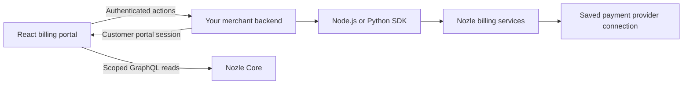

`BillingPortal` displays subscriptions, usage, invoice history/PDFs, billing details, and wallets. Add `cancellationActions` for Cancel/Keep and `planChangeActions` for upgrades, scheduled downgrades, and withdrawal of a pending change. These controls also work independently on a custom billing page.

<Info>
These exports and subscription-management additions are merged into the SDK repositories but await a package release. The published React `0.9.0`, Node `0.8.0`, and Python `0.8.0` packages do not include these additions. Use the merged source examples below to evaluate them. The matching hosted backend endpoints are available.
</Info>

## How requests flow



Your backend authenticates the user and chooses the Nozle customer. The browser sends the selected **external subscription ID**, and your backend and Nozle validate its ownership. Provider secret keys stay in Nozle's saved connection. Embedded Stripe can also require its matching public key.

Portal reads use a customer-scoped session issued by your backend. Subscription changes use authenticated merchant callbacks. `BillingPortal` requires neither `BillingProvider` nor Tailwind.

## Connect the portal

Serve these example merchant routes on the same HTTPS origin as your app, or proxy them there. Keep your application's session and CSRF protection. The route names below are examples from the SDK repositories, not public Nozle API paths.

```tsx
'use client';

import {
  BillingPortal,
  BillingPortalError,
  type BillingPortalSession,
  type CancellationActions,
  type CreateBillingPortalSession,
  type PlanChangeActions,
} from '@nozle-js/react';

async function post<T>(path: string, body: object, signal?: AbortSignal): Promise<T> {
  const response = await fetch(path, {
    method: 'POST',
    credentials: 'same-origin',
    headers: { 'Content-Type': 'application/json' },
    body: JSON.stringify(body),
    signal,
  });
  if (!response.ok) {
    throw new BillingPortalError(
      response.status === 401 || response.status === 403 ? 'unauthorized' :
      response.status === 409 ? 'changed' : 'request',
    );
  }
  return response.json();
}

const createSession: CreateBillingPortalSession = ({ signal }) =>
  post<BillingPortalSession>('/api/billing/session', {}, signal);

const cancellationActions: CancellationActions = {
  preview: ({ signal, ...body }) => post('/api/billing/cancellation/preview', body, signal),
  apply: ({ signal, ...body }) => post('/api/billing/cancellation', body, signal),
};

const planChangeActions: PlanChangeActions = {
  load: ({ signal, ...body }) => post('/api/billing/plans/load', body, signal),
  status: ({ signal, ...body }) => post('/api/billing/plans/status', body, signal),
  preview: ({ signal, ...body }) => post('/api/billing/plans/preview', body, signal),
  apply: ({ signal, ...body }) => post('/api/billing/plans/apply', body, signal),
  withdraw: ({ signal, ...body }) => post('/api/billing/plans/withdraw', body, signal),
  verifyCheckout: ({ signal, ...body }) => post('/api/billing/plans/checkout-verify', body, signal),
  getCheckoutStatus: ({ signal, ...body }) => post('/api/billing/plans/checkout-status', body, signal),
};

export function CustomerBilling({ accountId }: { accountId: string }) {
  return <BillingPortal key={accountId} createSession={createSession}
    cancellationActions={cancellationActions} planChangeActions={planChangeActions}
    locale="en-US" />;
}
```

The callbacks above are stable across renders. Remount the portal when the authenticated account changes so the previous customer's session, dialogs, and in-flight work are discarded. Never serialize `AbortSignal` into a request body.

### Issue the portal session

On the authenticated merchant backend, call Core's `GET /api/v1/customers/{external_id}/portal_url` with a server secret key. Use the customer from your application session. Parse the token from the returned `/customer-portal/{token}` URL, validating the expected URL origin and path, then return:

```json
{
  "token": "customer-scoped-portal-token",
  "apiUrl": "https://api.nozle.app/core"
}
```

`apiUrl` is the Core base without `/graphql`. The component sends `customer-portal-token` on GraphQL requests and keeps the token in memory. Return session responses with `Cache-Control: no-store`; do not embed a token in static JavaScript or store it in local storage. Self-hosted Core must allow your app origin and the portal header through CORS.

### Portal props

| Prop | Purpose |
| --- | --- |
| `createSession` | Required callback returning `{ token, apiUrl? }`. |
| `cancellationActions` | Optional Cancel/Keep adapter. Omit it to hide those controls. |
| `planChangeActions` | Optional plan-change adapter. Omit it to hide those controls. |
| `locale` | Amount/date formatting; defaults to `en-US`. Interface copy is English. |
| `onError` | Receives a redacted `BillingPortalError`. |
| `className`, `style`, `nonce` | Container styling and CSP nonce for scoped styles. |

Customize with `--nozle-portal-accent`, `--nozle-portal-background`, `--nozle-portal-text`, `--nozle-portal-muted`, `--nozle-portal-muted-background`, and `--nozle-portal-border`.

## Cancel and Keep

`CancellationActions.preview` receives `{ subscriptionId, operation, signal }`, where `operation` is `cancel` or `uncancel`. Return `{ operation, effectiveAt, renewalAt }` from the backend preview. Dates are ISO strings and `renewalAt` may be null.

`apply` receives the same identity/operation plus `idempotencyKey` and, for cancellation, `expectedEffectiveAt`. Choose end-of-period cancellation on your server and forward the exact preview timestamp, including its timezone and fractional seconds. A changed date returns HTTP 409 and requires a new confirmation.

The subscription remains active until its saved ending time. Keep removes the ending before it takes effect; it does not restart a terminated subscription. Cancellation clears a pending downgrade, and Keep does not recreate that removed change.

## Upgrade, downgrade, and recover payment

The merchant adapter converts SDK responses into the exported React types:

| Callback | Input in addition to `subscriptionId` and `signal` | Return |
| --- | --- | --- |
| `load`, `status` | — | `PlanChangeState` |
| `preview` | `targetPlanCode` | `PlanChangePreview` |
| `apply` | `targetPlanCode`, `quoteToken`, `idempotencyKey`, `returnUrl` | `CheckoutResult` |
| `withdraw` | `pendingChangeId`, `idempotencyKey` | Any successful result; the control reloads state. |
| `verifyCheckout` | `checkoutId`, `verification` | `CheckoutStatus`; needed for Razorpay. |
| `getCheckoutStatus` | `checkoutId` | `CheckoutStatus`; needed for payment recovery. |

`PlanChangeState` includes `subscriptionId`, `status`, `currentPlan`, `endingAt`, `pendingChange`, `eligiblePlans`, `blockedReason`, `checkout`, and `checkoutStatus`. Plans use `{ code, name, amountCents, currency, interval }`. Each eligible plan adds `operation: "upgrade" | "downgrade"`; a pending change is `{ id, plan, effectiveAt }` or null. `checkoutStatus` is `none`, `awaiting_payment`, `processing`, `succeeded`, `failed`, `expired`, or `needs_review`.

`PlanChangePreview` contains `operation`, `timing`, `currency`, `creditAmountCents`, `debitAmountCents`, `netAmountCents`, `amountDueNowCents`, `amountDueAtEffectiveCents`, `effectiveAt`, `renewalAt`, and `quoteToken`. Use the SDK's exact minor-unit values and dates; do not recompute proration in the browser or divide every currency by 100. `quoteToken` maps to the SDK's opaque `quote_id` response and `quoteId`/`quote_id` request argument.

The SDK responses use snake_case while these React adapters use camelCase. The runnable merchant examples below implement that mapping, eligible-plan validation, cancellation guards, checkout reconciliation and replay storage. Do not return an unmodified `SubscriptionOptions` object as `PlanChangeState`.

For each confirmed change:

1. Load policy-authorized targets for the selected subscription. The public catalog alone does not establish eligibility.
2. Show the backend quote, including amount due now, currency, effective date and renewal date.
3. Apply an upgrade through quoted checkout. Apply a downgrade through the existing end-of-period transition with `keep_anchor`.
4. Reload persisted state after submission, payment, uncertainty or a page reload. Keep the original idempotency key when retrying the same action.

A downgrade stays pending until renewal. Withdrawal targets its exact internal pending UUID; it does not cancel the active subscription. A stale pending ID conflicts instead of removing a replacement change.

A Razorpay payment must be captured before the upgrade is fulfilled. A Stripe callback or redirect alone does not activate the plan. Show success after authoritative state confirms activation; a recoverable checkout can resume after reload. For `needs_review`, direct the customer to your support route before another collection attempt.

## Use individual controls

Import `CancellationControl` and `PlanChangeControl` for your own billing layout. The cancellation control needs both the current subscription and a persisted-state `refresh`; the plan control loads its state through the adapter.

```tsx
import {
  CancellationControl, PlanChangeControl,
  type CancellationActions, type CancellationSubscription, type PlanChangeActions,
} from '@nozle-js/react';

export function SubscriptionControls(props: {
  accountId: string;
  subscription: CancellationSubscription;
  cancellationActions: CancellationActions;
  planChangeActions: PlanChangeActions;
  refresh: (signal: AbortSignal) => Promise<CancellationSubscription | null>;
  onChanged: () => void;
  refreshKey: string;
}) {
  return <div key={props.accountId}>
    <CancellationControl subscription={props.subscription}
      actions={props.cancellationActions} refresh={props.refresh} onChanged={props.onChanged} />
    <PlanChangeControl subscriptionId={props.subscription.externalId}
      actions={props.planChangeActions} onChanged={props.onChanged} refreshKey={props.refreshKey}
      returnUrl="https://app.example.com/settings/billing" />
  </div>;
}
```

`CancellationSubscription` contains the Core `id`, external `externalId`, `name`, `status`, `endingAt`, and optional `pendingPlanName`. Use the external ID for management requests; retain the internal UUID for portal reads. Refresh both controls and change `refreshKey` when another control updates the subscription. `BillingPortal` handles this coordination when they are embedded in it. Both controls also accept `locale`, `timezone`, `onError`, and `nonce`.

## Runnable backend integrations

- [Node merchant server and React app](https://github.com/nozle-dev/nozle-js/tree/9dc89add8d0935678230acd327bdc79291100e64/examples/billing-portal)
- [Python merchant server](https://github.com/nozle-dev/nozle-python/tree/5a3ac66a4508bfa616e68b7d352d7dec83f93f74/examples/billing_portal)
- [Node method reference](/sdks/node/billing#subscription-self-service) and [Python method reference](/sdks/python/billing#subscription-self-service)

Build the React package from the linked source revision and install that build for evaluation; installing the current registry version does not provide these exports. Follow the examples' READMEs for TLS and environment setup. Their demo login and single-process file replay store must be replaced with your application's authentication and transactional shared storage before serving production customers. Browser sessions use Secure, HttpOnly cookies over HTTPS.

The portal changes billing state. Enforce feature access on your application's server using Nozle entitlement checks. The hosted Engine observes cancellation at the saved ending boundary and Keep after commit, without waiting for its old subscription-cache refresh.
